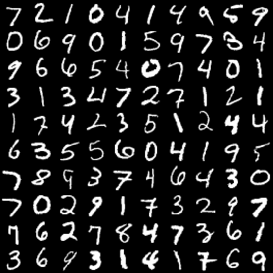
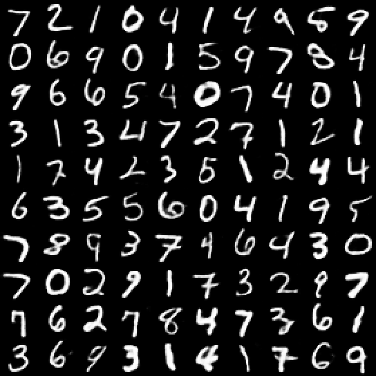
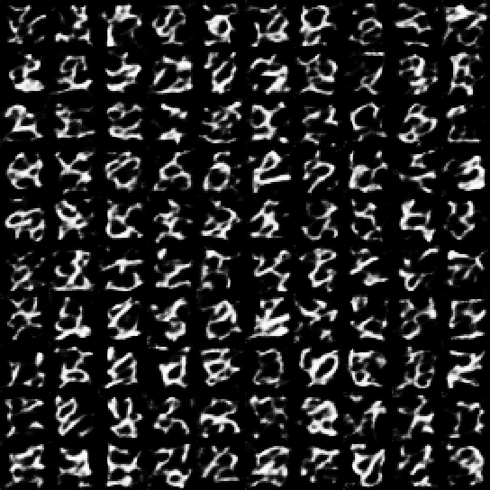
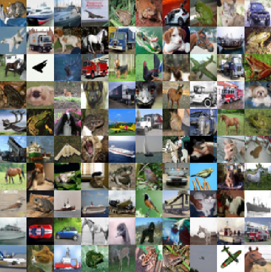
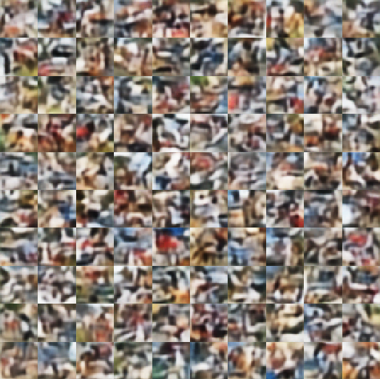
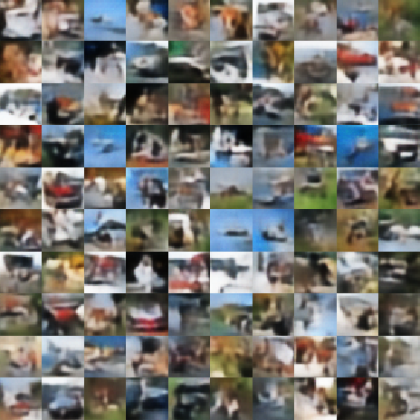

# VQ-VAE with PixelCNN prior

## Workflow
- Train the Vector Quantised Variational AutoEncoder (VQ-VAE) for discrete representation and reconstruction.
- Use PixelCNN to learn the priors on the discrete latents for image sampling. 

## Results
<table align='center'>
<tr align='center'>
<td> </td>
<td> Testing data </td>
<td> Reconstruction </td>
<td> Random samples </td>
<td> Samples based on PixelCNN prior </td>
</tr>
<tr align='center'>
<td> MNIST </td>
<td>
<td>
<td>
<td>
</tr>
<tr align='center'>
<td> cifar-10 </td>
<td>
<td>
<td>
<td>
</tr>
</table>
