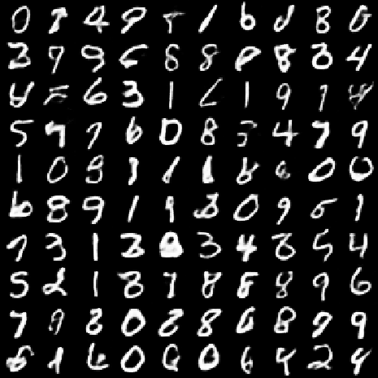
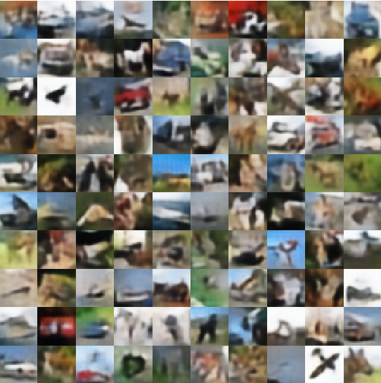

# VQ-VAE with PixelCNN prior
- We train the Vector Quantised

## Results
<table align='center'>
<tr align='center'>
<td> </td>
<td> Testing data </td>
<td> Reconstruction </td>
<td> Random samples </td>
<td> Samples based on PixelCNN prior </td>
</tr>
<tr align='center'>
<td> MNIST </td>
<td>
<td>
<td>
<td>
</tr>
<tr align='center'>
<td> cifar-10 </td>
<td>
<td>
<td>
<td>
</tr>
</table>
